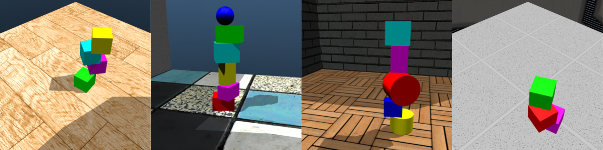

# ShapeStacks



This repository contains a Python interface to the ShapeStacks dataset. It also includes baseline models for intuitive physics tasks trained on ShapeStacks.

For more information about the project, please visit our project page at http://shapestacks.robots.ox.ac.uk

If you use the ShapeStacks dataset or the intuitive physics models of this repository, please cite our [publication](https://arxiv.org/pdf/1804.08018.pdf):

```
@misc{1804.08018,
Author = {Oliver Groth and Fabian Fuchs and Ingmar Posner and Andrea Vedaldi},
Title = {ShapeStacks: Learning Vision-Based Physical Intuition for Generalised Object Stacking},
Year = {2018},
Eprint = {arXiv:1804.08018},
}
```

## Software Requirements

The code has been tested on Ubuntu 16.04 with Python 3.5.2
The major software requiremets can be installed via:

```bash
$ apt-get install python3-pip python3-dev virtualenv
```

Also, in order to run the intuitive physics models efficiently on GPU, the latest NVIDIA drivers, CUDA and cuDNN frameworks which are compatible with Tensorflow should be installed.

## Installation

All Python dependencies of the ShapeStacks code should live in their own virtual environment. All runtime requirements can be easily installed via the following commands:

```bash
$ virtualenv -p python3 venv
$ source venv/bin/activate
(venv) $ pip3 install -r requirements.txt
```

Additional requirements for development purposes can be found in ```dev_requirements.txt``` and can be added on demand.

```bash
(venv) $ pip3 install -r dev_requirements.txt
```

## Data Setup

### ShapeStacks Data

The ShapeStacks dataset together with additional documentation can be downloaded [here](http://shapestacks.robots.ox.ac.uk/#data).

After downloading and unpacking the data, the dataset directory living under ```SHAPESTACKS_DATASET``` should look like this:

```
${SHAPESTACKS_DATASET}/
|__ meta/
    |__ blacklist_stable.txt
    |__ blacklist_unstable.txt
|__ mjcf/
    |__ meshes/
    |__ textures/
    |__ assets.xml
    |__ env_blocks-easy-h=2-vcom=0-vpsf=0-v=1.xml
    |__ ...
    |__ env_ccs-hard-h=6-vcom=5-vpsf=0-v=120.xml
    |__ world_blocks-easy-h=2-vcom=0-vpsf=0-v=1.xml
    |__ ...
    |__ world_ccs-hard-h=6-vcom=5-vpsf=0-v=120.xml
|__ recordings/
    |__ env_blocks-easy-h=2-vcom=0-vpsf=0-v=1/
    |__ ...
    |__ env_ccs-hard-h=6-vcom=5-vpsf=0-v=120/
|__ splits/
    |__ blocks_all/
        |__ ...
    |__ ccs_all/
        |__ eval.txt
        |__ test.txt
        |__ train.txt
        |__ eval_bgr_mean.npy
        |__ test_bgr_mean.npy
        |__ train_bgr_mean.npy
```

### FAIR Real Block Tower Images

For convenient use with this codebase, we also provide a restructured version of the real image test set of block towers released by [Lerer et al.](https://arxiv.org/abs/1603.01312) which can be downloaded [here](http://shapestacks.robots.ox.ac.uk/static/download/v1/fairblocks.tar.gz).

After downloading and unpacking the data, the dataset directory living under ```FAIRBLOCKS_DATASET``` should look like this:

```
${FAIRBLOCKS_DATASET}/
|__ meta/
|__ recordings/
    |__ img_frame1_1.png
    |__ ...
    |__ img_frame1_516.png
|__ splits/
    |__ default/
        |__ test.txt
        |__ test_bgr_mean.npy
```

## Data Provider

### ShapeStacks and Fairblocks Provider

We provide interfaces to ShapeStacks and FAIR's real block tower images via public input functions in [shapestacks_provider.py](data_provider/shapestacks_provider.py) and [fairblocks_provider.py](data_provider/fairblocks_provider.py). Those input functions can be used as ```input_fn``` to set up a ```tf.estimator.Estimator``` in tensorflow.

### Segmentation Utilities

We provide utility functions to load the custom segmentation maps of ShapeStacks in [segmentation_utils.py](data_provider/segmentation_utils.py).

## Running Scripts

Before any scripts containing a ```__main__``` function can be run, the virtual environment needs to be activated and some environment variables need to be set. This can be conveniently done via:

```bash
$ . ./activate_venv.sh
Set environment varibale SHAPESTACKS_CODE_HOME=/path/to/this/repository
Activated virtual environment 'venv'.
```

The complimentary script ```deactivate_venv.sh``` deactivates the environment again and unsets all environment variables.

```bash
$ . ./deactivate_venv.sh
Unset environment varibale SHAPESTACKS_CODE_HOME=
Deactivated virtual environment 'venv'.
```

### Example: Training a stability predictor

The script [train_inception_v4_shapestacks.py](intuitive_physics/stability_predictor/train_inception_v4_shapestacks.py) can be used to train a visual stability predictor on the ShapeStacks dataset. The main parameters are:

- ```--data_dir``` which needs to point to the dataset location ```SHAPESTACKS_DATASET``` (see the [dataset section](#shapestacks-data) for details)
- ```--model_dir``` which defines a ```MODEL_DIR``` where all the tensorflow output and snapshots will be stored during training
- ```--real_data_dir``` can optionally point to to the location ```FAIRBLOCKS_DATASET``` (see the [dataset section](#fair-real-block-tower-images) for details) to evaluate the performance of trained model snapshots on the real block tower images

An example run of the training script looks like this:

```bash
(venv) $ cd intuitive_physics/stability_predictor
(venv) $ python train_inception_v4_shapestacks.py \
--data_dir ${SHAPESTACKS_DATASET} \
--real_data_dir ${FAIRBLOCKS_DATASET} \
--model_dir ${MODEL_DIR}
```

After a successful run of the training script, a model directory should have been created and populated like this:

```
${MODEL_DIR}/
|__ eval_*/
    |__ events.out.tfevents.*
|__ snapshots/
  |__ eval=0.xxxxxx/
      |__ checkpoint
      |__ model.ckpt-xxxxxx.data-000000-of-000001
      |__ model.ckpt-xxxxxx.index
      |__ model.ckpt-xxxxxx.meta
  |__ topn_eval_models.dict
|__ checkpoint
|__ events.out.tfevents.*
|__ graph.pbtxt
|__ model.ckpt-xxxxxx.data-000000-of-000001
|__ model.ckpt-xxxxxx.index
|__ model.ckpt-xxxxxx.meta
|__ ...
```

You can track the training progress by pointing a tensorboard to the model's root directory:

```bash
(venv) $ tensorboard --logdir=stability_predictor:${MODEL_DIR}
```

The most recent model checkpoints during training are kept in the models's root directory. If the training script finds existing checkpoints in ```MODEL_DIR```, it will automatically load the most recent one of them and resume training from there.

During training, the checkpoints which perform best on the validation set are also saved to the ```snapshots/``` subdirectory. The amount of best checkpoints to keep can be set via ```--n_best_eval```.

We provide the best performing models from the [ShapeStacks paper]() on our [project page](http://shapestacks.robots.ox.ac.uk/#code).

### Example: Running a stability predictor

After a stability predictor has been trained, the latest checkpoint or a particular snapshot can be loaded back into a ```tf.estimator.Estimator```.

To instantiate a stability predictor as a ```tf.estimator.Estimator``` from the latest checkpoint in the ```MODEL_DIR``` you can use the following Python code:

```Python
import sys
import os
import tensorflow as tf

sys.path.insert(0, os.environ['SHAPESTACKS_CODE_HOME'])
from tf_models.inception.inception_model import inception_v4_logregr_model_fn

# ...

stability_predictor = tf.estimator.Estimator(
    model_fn=inception_v4_logregr_model_fn,
    model_dir=MODEL_DIR,
    config=run_config,
    params={})
```

You can also set the ```model_dir``` parameter of ```tf.estimator.Estimator``` to ```MODEL_DIR/snapshots/<snapshot_name>``` to load the weights of a particular snapshot.

Afterwards, you can call the standard estimator APIs ```evaluate()``` or ```predict()``` on the loaded estimator to run it on new data. A working example can be found in the provided test script [test_inception_v4_shapestacks.py](intuitive_physics/stability_predictor/test_inception_v4_shapestacks.py).

## Licensing

The model implementations under [tf_models](tf_models) are taken from the [official tensorflow models repository](https://github.com/tensorflow/models) and are licensed under the [Apache License, Version 2.0](http://www.apache.org/licenses/LICENSE-2.0).
