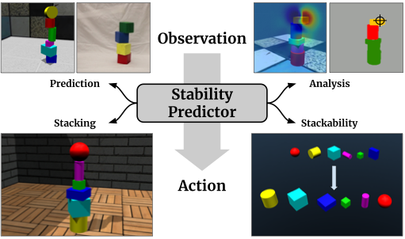

# ShapeStacks

## ShapeStacks Dataset

 [ShapeStacks-Manual.md](http://shapestacks-file.robots.ox.ac.uk/static/download/v1/ShapeStacks-Manual.md)

MuJoCo world definitions (39 MB):\
 [shapestacks-mjcf.tar.gz](http://shapestacks-file.robots.ox.ac.uk/static/download/v1/shapestacks-mjcf.tar.gz) &middot; [shapestacks-mjcf.md5](http://shapestacks-file.robots.ox.ac.uk/static/download/v1/shapestacks-mjcf.md5)

Meta information (156 KB):\
 [shapestacks-meta.tar.gz](http://shapestacks-file.robots.ox.ac.uk/static/download/v1/shapestacks-meta.tar.gz) &middot; [shapestacks-meta.md5](http://shapestacks-file.robots.ox.ac.uk/static/download/v1/shapestacks-meta.md5)

RGB images (33 GB):\
 [shapestacks-rgb.tar.gz](http://shapestacks-file.robots.ox.ac.uk/static/download/v1/shapestacks-rgb.tar.gz) &middot; [shapestacks-rgb.md5](http://shapestacks-file.robots.ox.ac.uk/static/download/v1/shapestacks-rgb.md5)

Violation segmentation maps (875 MB):\
 [shapestacks-vseg.tar.gz](http://shapestacks-file.robots.ox.ac.uk/static/download/v1/shapestacks-vseg.tar.gz) &middot; [shapestacks-vseg.md5](http://shapestacks-file.robots.ox.ac.uk/static/download/v1/shapestacks-vseg.md5)

Depth maps (1.1 GB):\
 [shapestacks-depth.tar.gz](http://shapestacks-file.robots.ox.ac.uk/static/download/v1/shapestacks-depth.tar.gz) &middot; [shapestacks-depth.md5](http://shapestacks-file.robots.ox.ac.uk/static/download/v1/shapestacks-depth.md5)

## Source Code

 Check out the [source code](https://github.com/ogroth/shapestacks) on GitHub.

We provide a dataset handler for ShapeStacks using Tensorflow dataset API.
It also contains example scripts for training and evaluation of the stablity prediction models.

Pre-trained stability prediction models based on InceptionV4 (1.8 GB):\
 [shapestacks-incpv4.tar.gz](http://shapestacks-file.robots.ox.ac.uk/static/download/v1/shapestacks-incpv4.tar.gz) &middot; [shapestacks-incpv4.md5](http://shapestacks-file.robots.ox.ac.uk/static/download/v1/shapestacks-incpv4.md5)

## Paper @ ECCV 2018

 [[paper]](https://openaccess.thecvf.com/content_ECCV_2018/papers/Oliver_Groth_ShapeStacks_Learning_Vision-Based_ECCV_2018_paper.pdf)  [[poster]](http://shapestacks-file.robots.ox.ac.uk/static/download/eccv18/ShapeStacks_poster.pdf)  [[video]](http://shapestacks-file.robots.ox.ac.uk/static/download/eccv18/ShapeStacks_video.mp4)

Physical intuition is pivotal for intelligent agents to perform complex tasks. In this paper we investigate the passive acquisition of an intuitive understanding of physical principles as well as the active utilisation of this intuition in the context of generalised object stacking. To this end, we provide ShapeStacks: a simulation-based dataset featuring 20,000 stack configurations composed of a variety of elementary geometric primitives richly annotated regarding semantics and structural stability.

## Contact

|  |  |  |
|----------|----------|----------|
| [Oliver Groth](https://ogroth.github.io/), [Fabian Fuchs](https://fabianfuchsml.github.io/), [Ingmar Posner](https://ori.ox.ac.uk/people/ingmar-posner/), [Andrea Vedaldi](https://www.robots.ox.ac.uk/~vedaldi/) |  [Applied AI Lab](https://ori.ox.ac.uk/labs/a2i/), [Visual Geometry Group](https://www.robots.ox.ac.uk/~vgg/) | Research funded by ERC 677195-IDIU, AIMS-CDT |